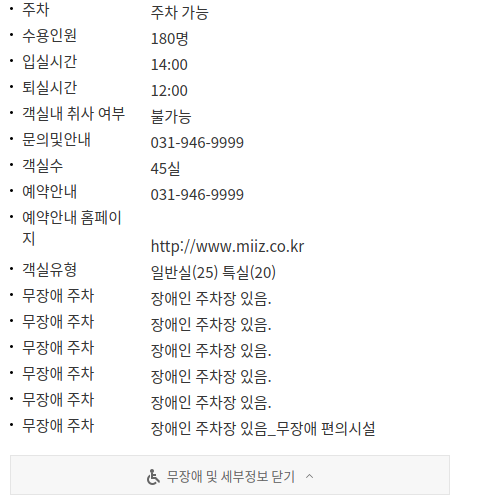
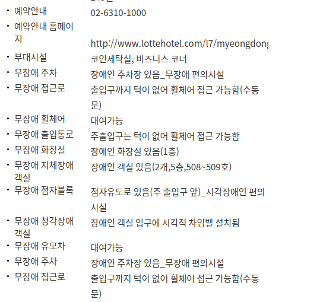
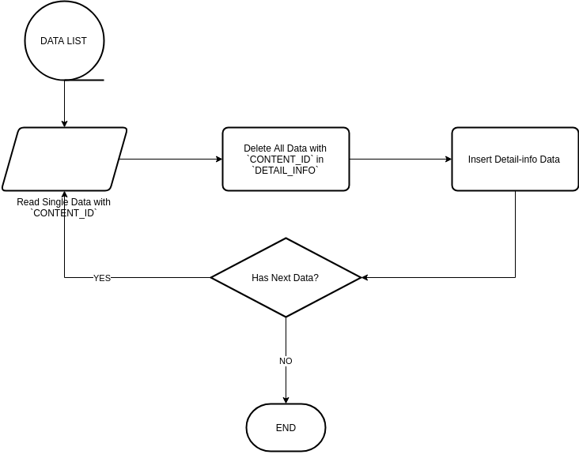

# 무장애 관광 상세 정보중 겹쳐나오는 데이터 정리 - 2018. 10. 24

## 사이트 (https://visitkorea.cf) 에서 무장애 반복정보(상세)중 동일한 정보가 두번이상 겹쳐 나오는 예
- [예1 - 호텔미즈](https://visitkorea.cf/detail/ms_detail.html?cotid=1f49daba-53a6-499c-83ab-06d616f2f2a1) - `COT_ID` = `1f49daba-53a6-499c-83ab-06d616f2f2a1`
  - `[무장애 및 세부정보 더보기]` 버튼을 눌러 내용을 펼치면 동일한 **주차정보**가 여러개 겹쳐 나옴<br/><br/>
<br/><br/>
- [예2 - 선셋호텔](https://visitkorea.cf/detail/ms_detail.html?cotid=387831c7-fcb1-437a-a1ab-e0fb1ba455d0) - `COT_ID` = `387831c7-fcb1-437a-a1ab-e0fb1ba455d0`
  - `[무장애 및 세부정보 더보기]` 버튼을 눌러 내용을 펼치면 동일한 **무장애 주차**, **무장애 접근로**, **무장애 점자블록**가 여러개 겹쳐 나옴<br/><br/>
<br/><br/>

## **예1**.에 대한 `CONTENT_ID`, `CONTENT_TYPE`를 구함
``` sql
SELECT CONTENT_ID, CONTENT_TYPE 
  FROM CONTENT_MASTER 
 WHERE COT_ID = '1f49daba-53a6-499c-83ab-06d616f2f2a1';
```
|CONTENT_ID|CONTENT_TYPE|
|:--------:|:----------:|
|724643    |32          |

## Visual Studio Code의 Extension `REST CLIENT`를 이용하여 Tour API 호출 테스트
::: tip
- Visual Studio Code 설치가 필요하다면 [설치하러 가기](https://code.visualstudio.com)
- [REST Client Extension](https://marketplace.visualstudio.com/items?itemName=humao.rest-client)
- [무장애 여행 정보 API 요청 양식 내려받기](/무장애_여행_API.docx)
:::
### 무장애 관광 시설정보 조회
``` http
GET http://api.visitkorea.or.kr/openapi/service/rest/KorWithService/detailWithTour
    ?ServiceKey={{key}}
    &MobileOS={{os}}
    &MobileApp={{app}}
    &contentId=724643
    &contentTypeId=32
Accept: application/json
```
[>> RESPONSE](./response-1.md)
::: danger 결과
Tour API 에서 제공되는 결과는 모두 1개의 정보만 포함하고 있다.
하지만, 저장 DB의 **`DETAIL_INFO`** 테이블에는 중복된 데이터가 여럿 존재한다.
:::

### 중복된 정보를 갖는 제목의 COT_ID별 반복 개수
``` sql
SELECT COT_ID, DISPLAY_TITLE, COUNT(*) 
  FROM DETAIL_INFO
 GROUP BY COT_ID, DISPLAY_TITLE 
HAVING COUNT(*) >= 2
```
|COT_ID|DISPLAY_TITLE|COUNT(*)|
|:----------------------------------:|---------|:-:|
|003db92f-cad5-4477-ad65-7773a69a4553|유도안내설비|4|
|003db92f-cad5-4477-ad65-7773a69a4553|점자블록|4|
|003db92f-cad5-4477-ad65-7773a69a4553|접근로|4|
|003db92f-cad5-4477-ad65-7773a69a4553|주차|4|
|00e83a2d-e26e-4411-a68b-f2a5f4282b75|보조견동반|4|
|00e83a2d-e26e-4411-a68b-f2a5f4282b75|출입통로|4|
|00e83a2d-e26e-4411-a68b-f2a5f4282b75|화장실|4|
|01e56562-ff98-46aa-9e74-0f78c9da16b0|접근로|5|
|01e56562-ff98-46aa-9e74-0f78c9da16b0|지체장애 객실|5|
|01e56562-ff98-46aa-9e74-0f78c9da16b0|출입통로|5|
|..|..|..|..|

## 해결 전략
### 모든 관련 데이터(무장애 상세)를 삭제하고 Tour API를 통해 새로이 등록한다.
1. _Tour API_를 통해 무장애 지역 관광 정보를 모두 가져온다.
   - 총 개수를 가져온다.
   ``` http
   GET http://api.visitkorea.or.kr/openapi/service/rest/KorWithService/areaBasedList
       ?ServiceKey={{key}}
       &MobileOS={{os}}
       &MobileApp={{app}}
       &listYN=N
   Accept: application/json
   ```
   [>> RESPONSE](./response-2.md)
   - 모든 리스트를 가져온다.
   ``` http
   GET http://api.visitkorea.or.kr/openapi/service/rest/KorWithService/areaBasedList
       ?ServiceKey={{key}}
       &MobileOS={{os}}
       &MobileApp={{app}}
       &listYN=Y
       &arrange=C
       &pageNo=1
       &numOfRows=5290
   Accept: application/json
   ```
   [>> RESPONSE](./response-3.md)
1. 가져온 정보를 적당한 데이터 형식(XML, JSON)의 파일로 저장한다.
1. 다시 파일을 읽어 One by One 데이터 처리를 한다. 
   - 처리 방법은 아래 Flow Chart를 통해 확인하자!
   

::: tip
특정 **`CONTENT_ID`** 에 해당하는 **`DETAIL_INFO`** DATA를 모두 삭제한다. 
``` sql
DELETE FROM DETAIL_INFO 
 WHERE COT_ID = (
   SELECT COT_ID 
     FROM CONTENT_MASTER
    WHERE CONTENT_ID = '<content_id>'
 );
```
:::
::: tip
**`DETAIL_INFO`** 에 데이터를 등록한다.
``` sql
INSERT INTO DETAIL_INFO(COT_ID, FLD_GUBUN, DISPLAY_TITLE, CONTENT_BODY)
VALUES (
    '<cot_id>',
    5, -- 고정 number type
    '<display_title>',
    '<content_body>'
), ...;
```
**`FLD_GUBUN`** => **5** **무장애** 정보 구분 플래그 값이다.
:::

